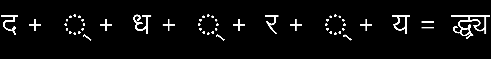
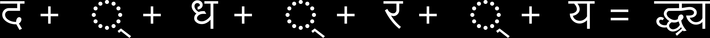
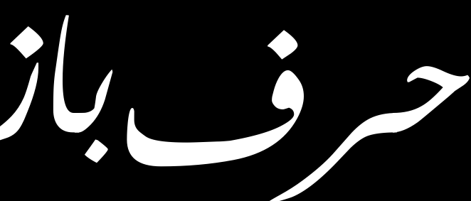
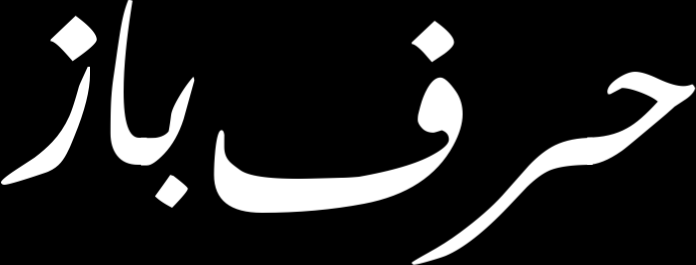

# HarfBuzz python demos

This project currently has one script: `hb-view.py`, a re-implementation of some of the functionalilty of upstream HarfBuzz's C++
based `hb-view` utilility, with some additional and extra functionality inspired by and taken from `hb-shape`. It uses pygobject and
HarfBuzz's gobject binding, which is maintained within HarfBuzz.

Specifically, it does ink-box tight-cropping by default, and output PNG images. It also calculates margin adjustments, so that you
can use upstream HarfBuzz's C++ based `hb-view` utilility to generate vector images with tight-cropping.
Upstream HarfBuzz's C++ based `hb-view` utilility uses descender/ascender + advance-width , which could be substantially larger or smaller than
the ink area.

For example, for the Persian "HarfBuzz" image below, `hb-view.py` would output this before generating the PNG image:

```
default: 693.75 314.375
ink box: 695.25 264.875
margin: -21.25 -1.625 3.75 35.125
```

You can cut-and-paste this and run C++ `hb-view` with `--margin="-21.25 -1.625 3.75 35.125"` to get a vector svg/pdf/ps/eps image of the ink-box area,
if you need a vector image.

There is an option for `hb-view.py` to use descender/ascender . The drawing code is not a step-by-step translation of C Cairo code to
pycairo Python code, so in both kinds of outputs (ink-box based or descender/ascender+advance-width based), sub-pixel differences are expected.
However, differences should not be beyond fractional pixels.

See below for output demos, and [vertical layout](README.vertical.md) for vertical-layout examples, [variation selector examples](variation-selectors.md).

All the images are generated by the [script](gen-images.sh), using either libre fonts or fonts from Windows.
They should be commonly accessible.

# Requirement

The descender/ascender code depends on a recent bug fix ( https://github.com/harfbuzz/harfbuzz/pull/1209 ) to harfbuzz from me.
This was merged after HarfBuzz version 1.9.0 and first appeared in 2.0.0 (released on Oct 18, 2018).
Another fix ( https://github.com/harfbuzz/harfbuzz/pull/1363 ) was merged and first appeared in 2.1.2 .

You need to build and install harfbuzz with introspection (`./configure --with-gobject --enable-introspection`), and have pygobject
(https://wiki.gnome.org/Projects/PyGObject). The latter should be readily available as pre-packaged on many systems. 

The drawing code requires freetype-py and pycairo, and uses PIL to display the PNG image.

Highly recommended is pgi-docgen, ( see the HarfBuzz example in https://github.com/pygobject/pgi-docgen/pull/172 )
to generate the HarfBuzz python API reference documentation. API doc
generation from gobject doc tool is at best described as both incorrect and incomplete
( https://gitlab.gnome.org/GNOME/gobject-introspection/issues/235 ) .

# Background

This comes about from a need for generating figures for the purpose of illustrating /demonstrating complex text layout.

While playing with Sanskrit ligatures in Devanagari (which has hugh ascender/decender and plenty of empty spaces)
and also Arabic (which can have strokes outside and clipped by the ascender/decender area), I decided that I don't like C++
( https://github.com/behdad/harfbuzz/issues/79 ) and thought this kind of tasks should be done by a scripting tool
instead of a compiled one.

Sanskrit ligatures use diacritics both above and below the main shape extensively, so have hugh ascender/decenders.
The C++ tool's default (with `--background="#000000" --foreground="#FFFFFF"` for clarity) shows this, especially with the
default margin of 16:



Here is the ink-box image from the python tool:



On the other hand, Arabic writing can go beyond the area declared by ascender/descenders and advance width.
( `--background="#000000" --foreground="#FFFFFF" --margin=0,0,0,0`). The uneven margins on the 4 directions
would also be difficult to set manually. Here is the Persian word for "HarfBuzz", note the clipping below and on the left-side:



Here is the ink-box image from the python tool:



More than two years before the Devanagari/Arabic activities, I first encountered https://github.com/behdad/harfbuzz/issues/79 with CJK fonts.
When one is generating an image of CJK glyphs, one expect equal margins around the square shapes.
I was surprised by the empty space below, though it is understandable that many CJK fonts have Latin glyphs and have a descender area.

Don't forget to checkout the [vertical layout](README.vertical.md) images too, and [variation selector examples](variation-selectors.md).

The C++ `hb-view` also has an inconsistency, special-casing `ansi` output: `ansi` drawings skips blank ascender/descender areas above and
below the ink-box.
