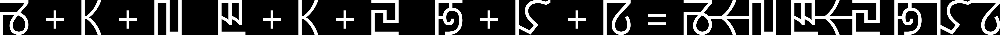

# Vertical layout examples

Unlike `c++ hb-view`, `hb-view.py` defaults to vertical for CJK, and also the two Mongolian scripts.

Here are three examples:

  

The below is from `c++ hb-view`. Note that the small kana is aligned differently in vertical layout; and of course, the rotated
quotation marks:

Here is a break-down of the individual letters in the Phags Pa example:

