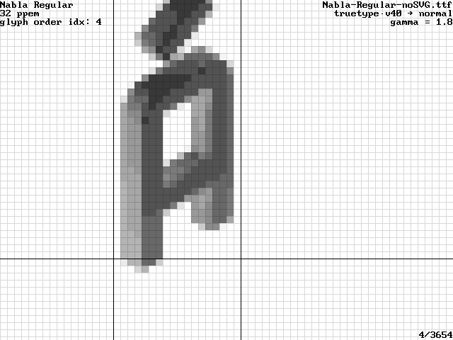
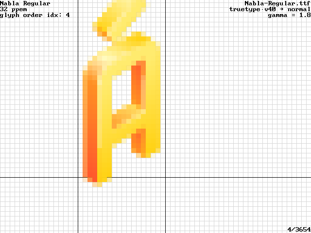
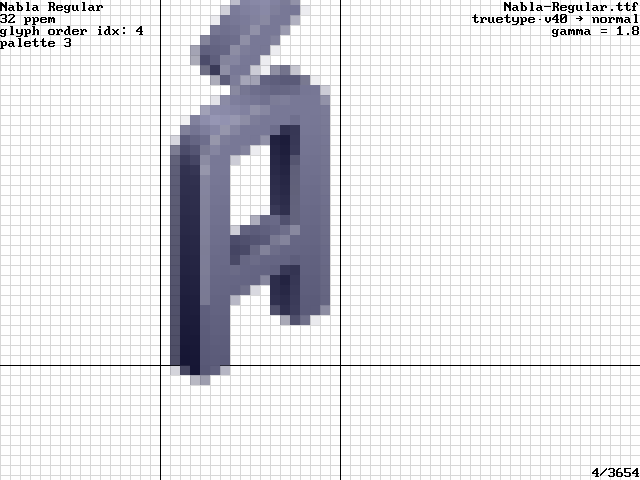
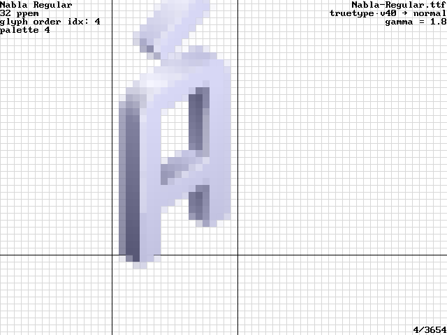

This is a patch to adds 3 other OT-SVG hooks to FreeType2-demos. There is an extension on top of it, to
add COLRv1 rendering, too.

The COLRv1 extension currently has a limitation - it works by over-writing
the SVG rendering with a toggle key, so it depends on the font having a SVG table. In one without, it overwrites
the glyh rendering and does gray. (Hope to fix). So it is convenient that both Rsvg and Adobe SVG rendering are flawed.
[Adobe SVG Native](https://github.com/adobe/svg-native-viewer/issues/185) , and [Rsvg issue](https://gitlab.gnome.org/GNOME/librsvg/-/issues/997).

It is a toggle-key to toggle SVG<->COLRv1 rendering ("z" for "color layered glyphs" as for COLRv0),
and overloads the palette toggle key ("C" for switching palettes for color-blind-friendiness in glyf mode)
to switch CPAL entries. Binaries at the [FontVal binary archive](https://github.com/FontVal-extras/binary-archive/) ).

## Skia COLRv1 Rendering

Skia COLRv1:

The glyf data:

Skia COLRv1 to Alpha channel:

Skia COLRv1 to Gray:

## COLRv1 Glyphs vs SVG Glyphs, both rendered via Skia

Skia COLRv1:

Skia SVG:

Difficult to tell the difference by the naked eye. Here is the programmatic highlights (with ImageMagick's `compare`):

## COLRv1 palettes

index 0:

index 1:

index 2:

index 3:

index 4:

index 5:

index 6:

