This is a patch to adds 3 other OT-SVG hooks to FreeType2-demos. There is an extension on top of it, to
add COLRv1 rendering, too.

## Librsvg/Cairo SVG Rendering vs SKia SVG Rendering

See the top of the RSVG rendering. There are a few very pale pixels over the bound box. This difference
is consistent across rendering different glyphs.

Librsvg:

Skia:

This seems to be a bug in rsvg-based (2.56.2 and 2.56.90-12-g1b589574) SVG rendering:

Librsvg:

Skia:

Filed as https://gitlab.gnome.org/GNOME/librsvg/-/issues/997 . Apparently it
is due to the use of CSS `var()` to reference colors. Looks like the
librsvg folks will try to support `var(--foo, #rrggbb)` fallbacks
as a workaround.

Interestingly, [SVG Native](https://github.com/adobe/svg-native-viewer) renders it half-way.
( filed as https://github.com/adobe/svg-native-viewer/issues/185 )

More screenshots about SVG Native in [the directory above](../svg-native/).

Inkscape also have problems with this SVG ( https://gitlab.com/inkscape/inbox/-/issues/8857 , moved from
https://gitlab.com/inkscape/inkscape/-/issues/4423 )

## Skia COLRv1 Rendering

Skia COLRv1:

The glyf data:

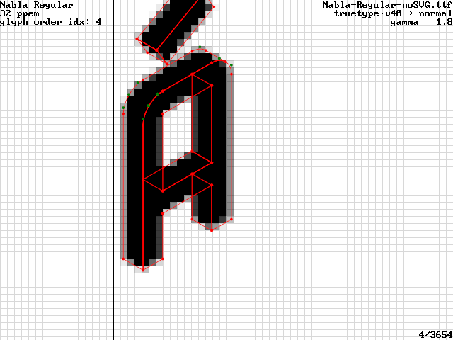

Skia COLRv1 to Alpha channel:

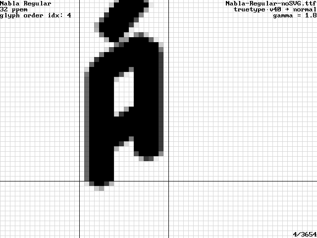

Skia COLRv1 to Gray:
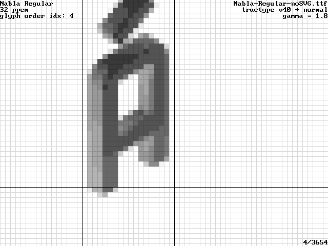

## COLRv1 Glyphs vs SVG Glyphs, both rendered via Skia

Skia COLRv1:

Skia SVG:

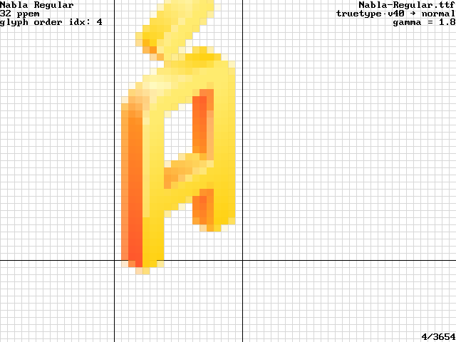

Difficult to tell the difference by the naked eye. Here is the programmatic highlights (with ImageMagick's `compare`):

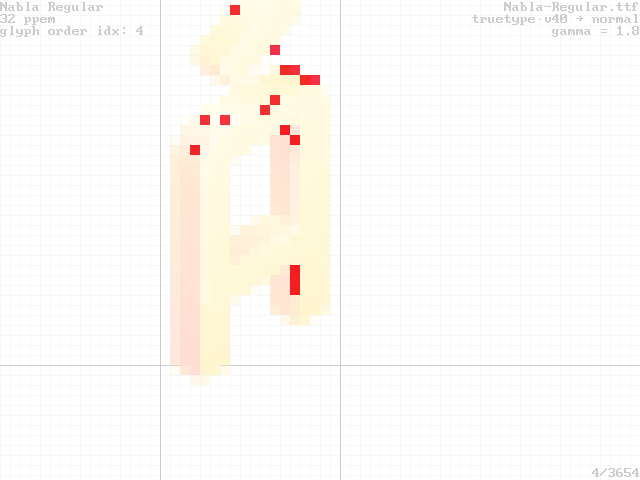

## COLRv1 palettes

index 0:

index 1:

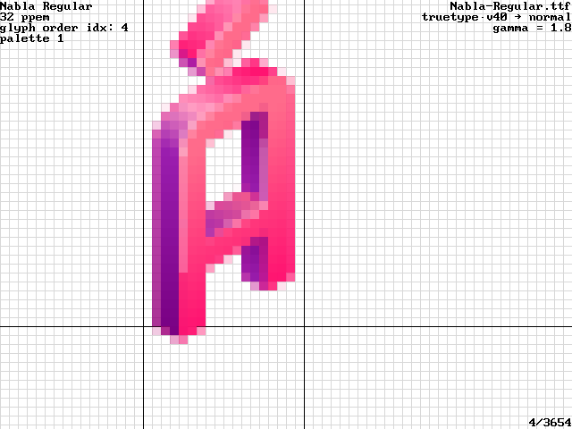

index 2:

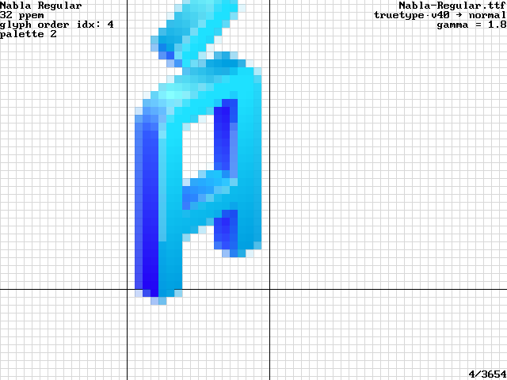

index 3:

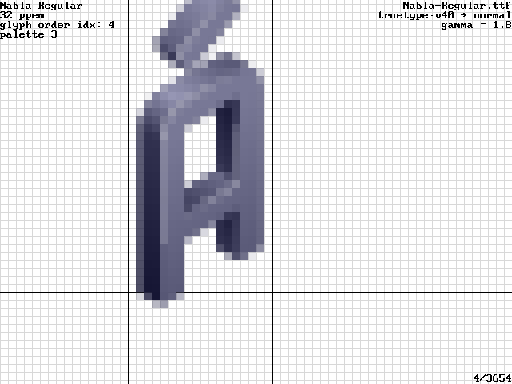

index 4:

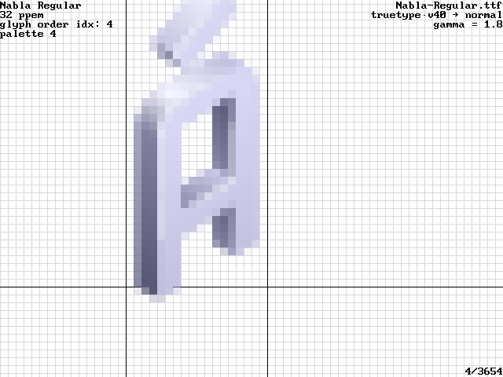

index 5:

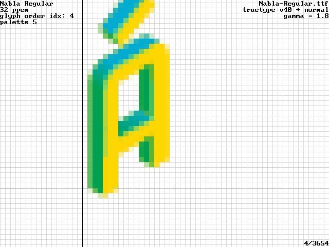

index 6:

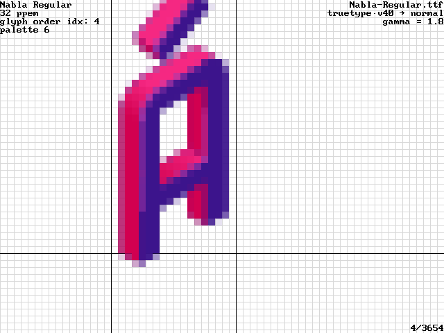
