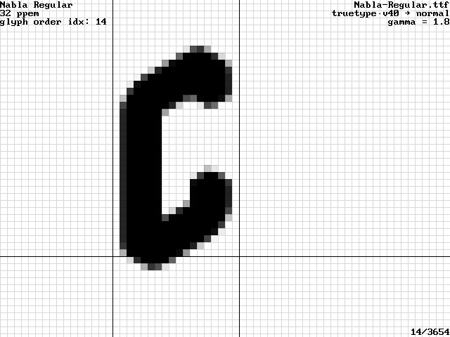
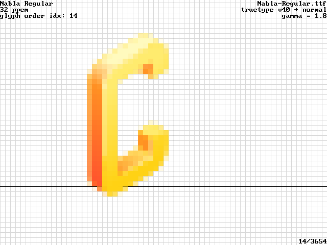
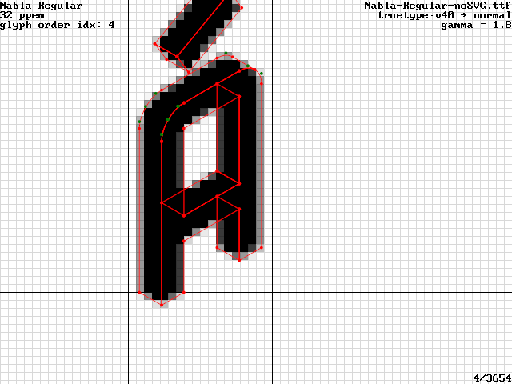
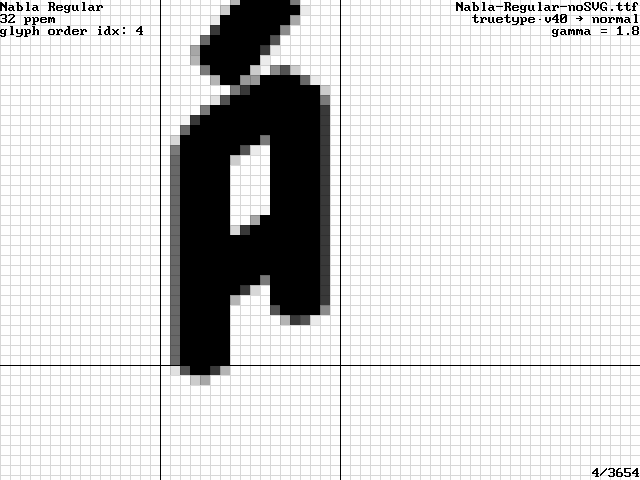
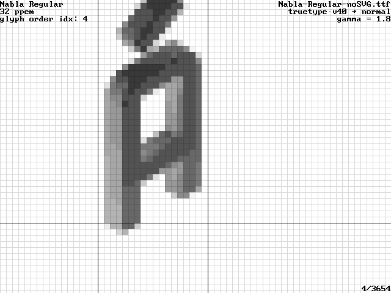
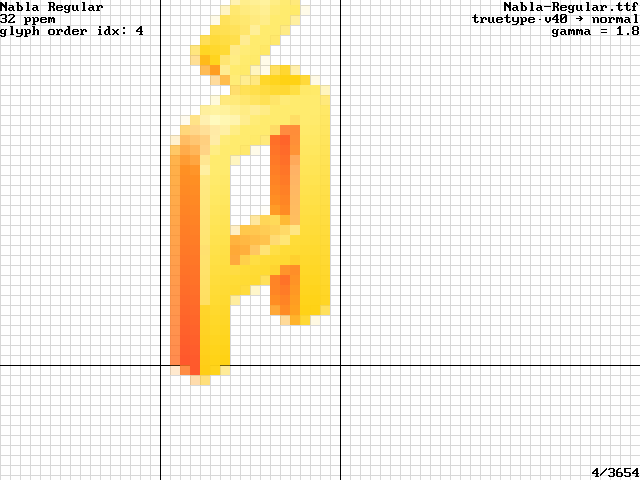
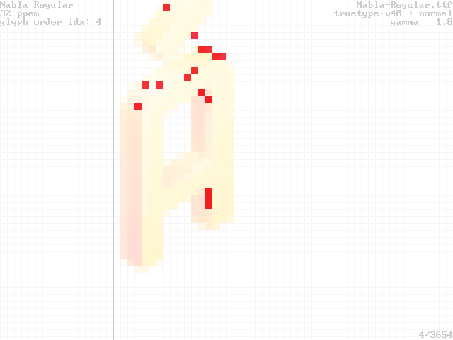

## Librsvg/Cairo SVG Rendering vs SKia SVG Rendering

See the top of the RSVG rendering. There are a few very pale pixels over the bound box. This difference
is consistent across rendering different glyphs.

This seems to be a bug in rsvg-based (2.56.2 and 2.56.90-12-g1b589574) SVG rendering:

Filed as https://gitlab.gnome.org/GNOME/librsvg/-/issues/997 . Apparently it
is due to the use of CSS `var()` to reference colors. Looks like the
librsvg folks will try to support `var(--foo, #rrggbb)` fallbacks
as a workaround.

## Skia COLRv1 Rendering

Skia COLRv1:

The glyf data:

Skia COLRv1 to Alpha channel:

Skia COLRv1 to Gray:

## COLRv1 Glyphs vs SVG Glyphs, rendered via Skia

Skia COLRv1:

Skia SVG:

Difficult to tell the difference by the naked eye. Here is the programmatic highlights (with ImageMagick's `compare`):

