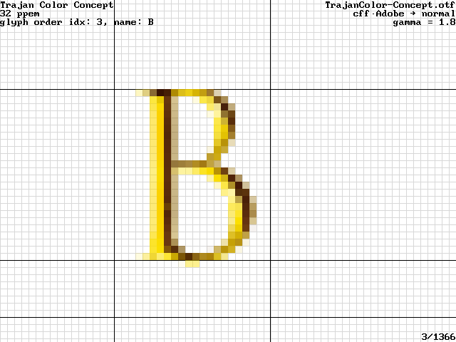
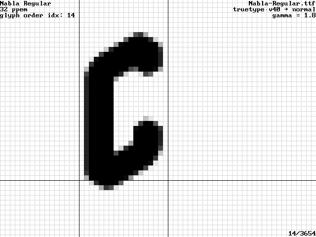
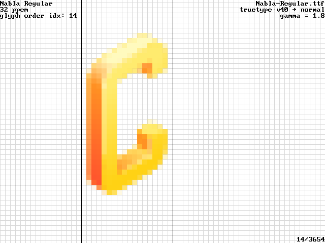
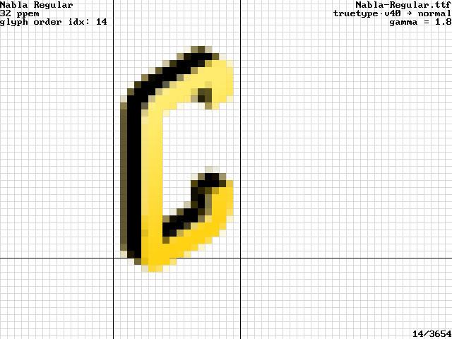

The skia-enhanced freetype2-demos now has its own [repo](https://github.com/HinTak/freetype2-demos-skia).
There is an extension on top of it, to add COLRv1 rendering, too. This page is mostly historical, except
the svg-native viewer issue.

## Librsvg/Cairo SVG Rendering vs SKia SVG Rendering

See the top of the RSVG rendering. There are a few very pale pixels over the bound box. This difference
is consistent across rendering different glyphs.

Librsvg:

Skia:

This seems to be a bug in rsvg-based (2.56.2 and 2.56.90-12-g1b589574) SVG rendering:

Librsvg:

Skia:

Filed as https://gitlab.gnome.org/GNOME/librsvg/-/issues/997 . Apparently it
is due to the use of CSS `var()` to reference colors. Looks like the
librsvg folks will try to support `var(--foo, #rrggbb)` fallbacks
as a workaround. The bug was fixed in 2.57.1, and verified to be so.

Interestingly, [SVG Native](https://github.com/adobe/svg-native-viewer) renders it half-way.
( filed as https://github.com/adobe/svg-native-viewer/issues/185 )

More screenshots about SVG Native in [the directory above](../svg-native/).

Inkscape also have problems with this SVG ( https://gitlab.com/inkscape/inbox/-/issues/8857 , moved from
https://gitlab.com/inkscape/inkscape/-/issues/4423 )

