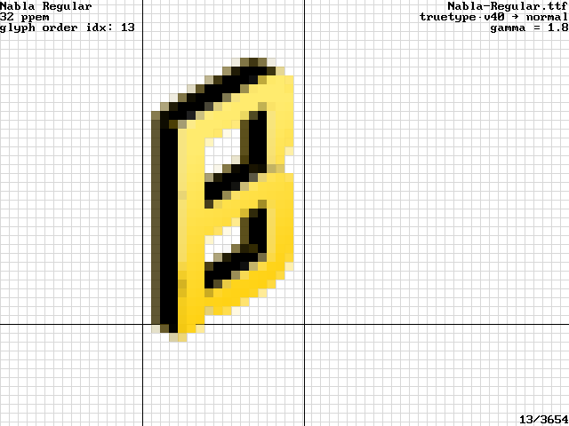

[svg native viewer issue 185](https://github.com/adobe/svg-native-viewer/issues/185):

[Skia m116 core support](https://github.com/adobe/svg-native-viewer/pull/189),
[This svg from google fonts gets mis-rendered.](https://github.com/adobe/svg-native-viewer/issues/185),
[Missing <cstdint> in svgnative/SVGRenderer.h](https://github.com/adobe/svg-native-viewer/issues/186),
[A few compatibility issues with skia m110](https://github.com/adobe/svg-native-viewer/issues/187),
[A few compatibility issues with recent cairo](https://github.com/adobe/svg-native-viewer/issues/188).
