# Five different Mongolian fonts

Mongolian Baiti

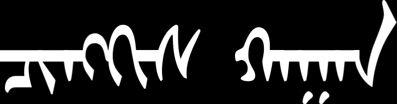

Noto Sans Mongolian

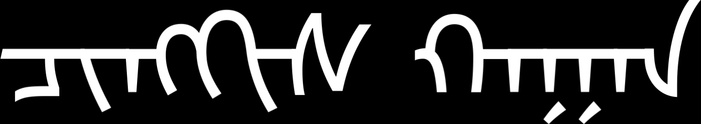

Mongolian Title

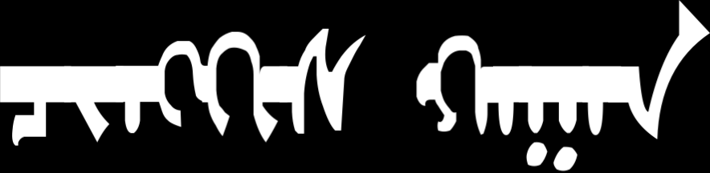

Mongolian White

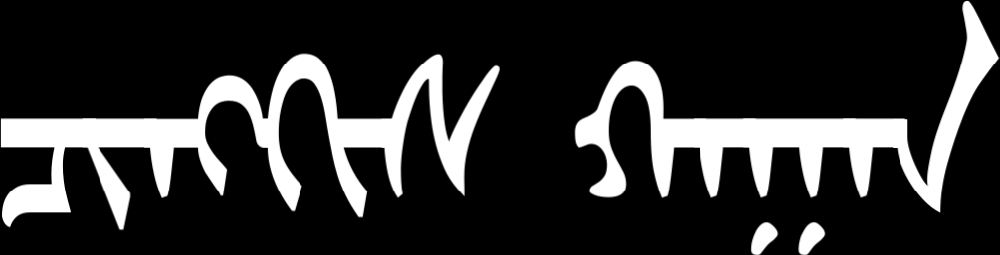

Mongolian Writing

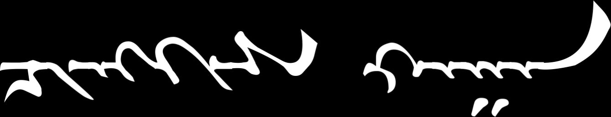

(all the images on this page generated with this [script](mongolian-variants.sh) ).

# Free Variation Selectors

## Mongolian Baiti:

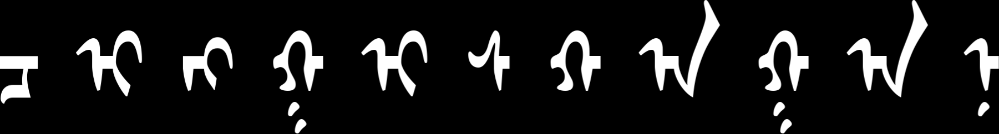

Mongolian Baiti FVS1 (QA and A):

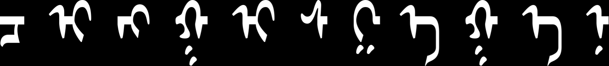

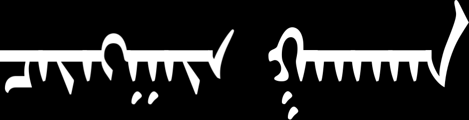

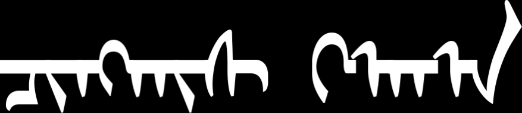

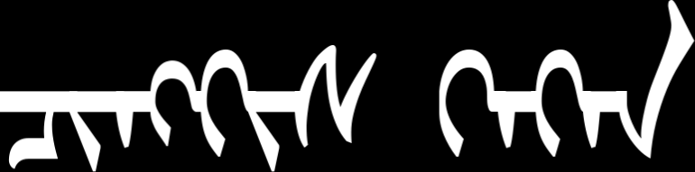

## Noto Sans Mongolian:

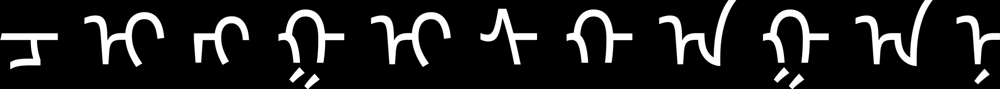

Noto Sans Mongolian FVS1 (GA, QA, A, NA):

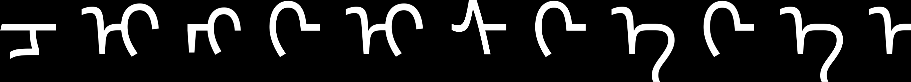
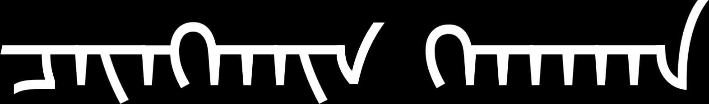

Noto Sans Mongolian FVS2 (GA, QA; GA same as FVS1):

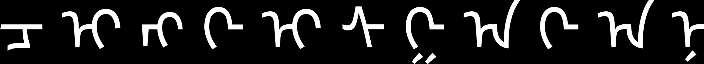
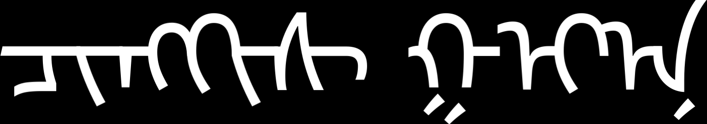

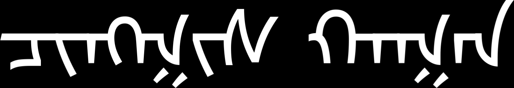

## Mongolian Title:

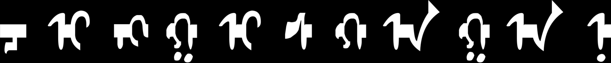

Mongolian Title FVS1 (I, GA, QA, A, NA):

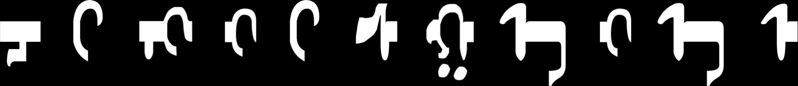
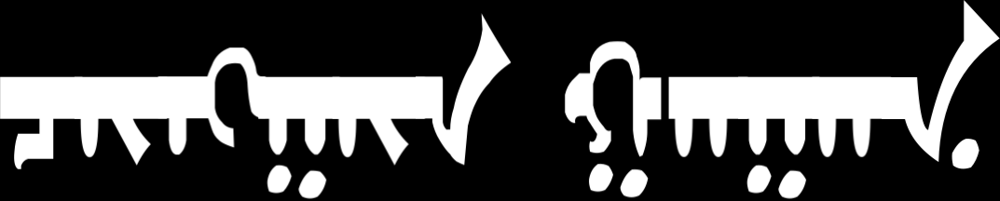

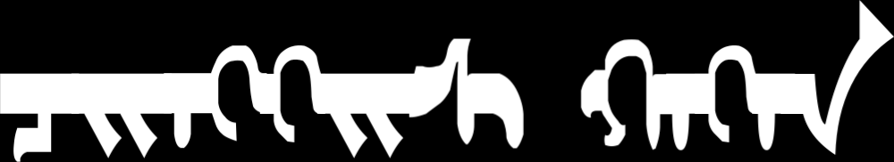

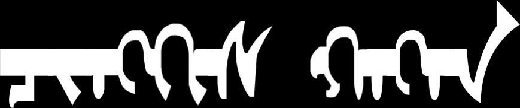

## Mongolian White:

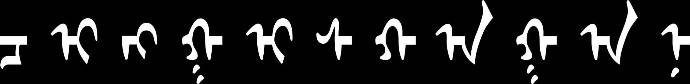

Mongolian White FVS1 (I, GA, QA, A, NA) :

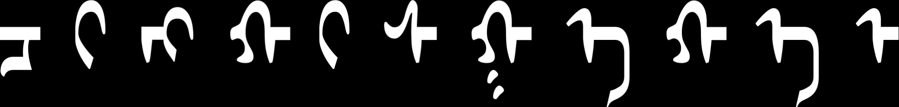
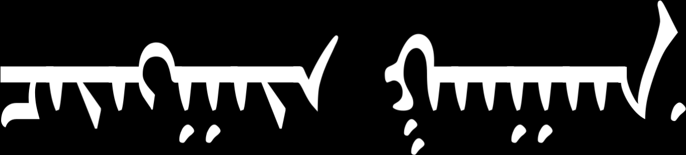

Mongolian White FVS2 (GA, QA):

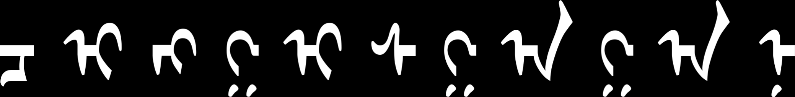
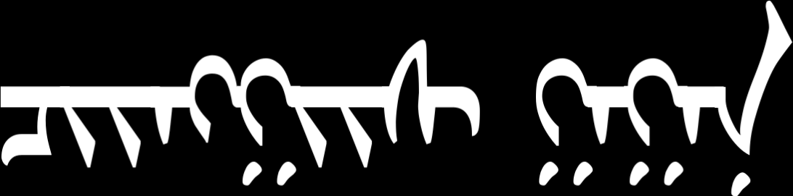

Mongolian White FVS3 (GA, QA):

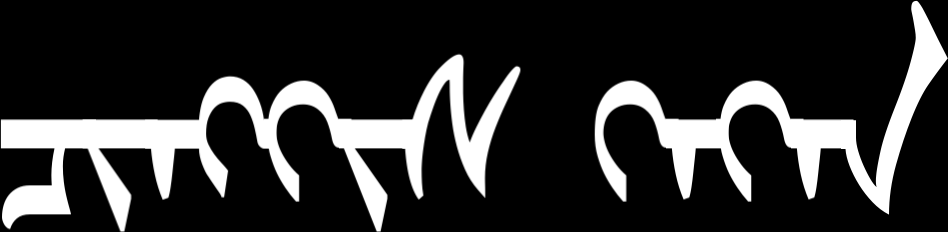

## Mongolian Writing:

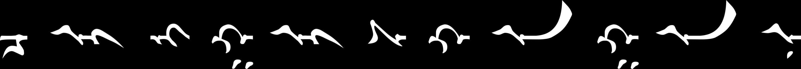

Mongolian Writing FVS1 (I, GA, QA, A, NA):

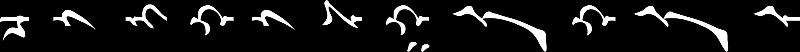
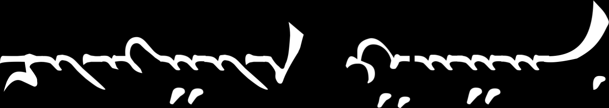

Mongolian Writing FVS2 (GA, QA):

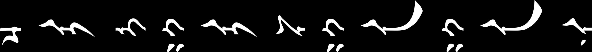

Mongolian Writing FVS3 (GA, QA):

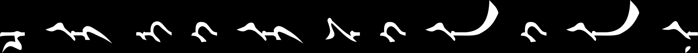
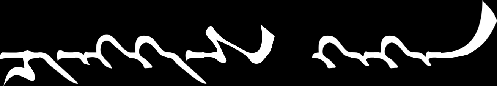

