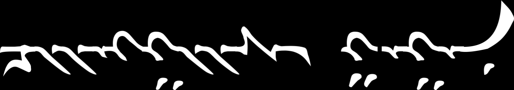

# Five different Mongolian fonts

Mongolian Baiti

Noto Sans Mongolian

Mongolian Title

Mongolian White

Mongolian Writing

(all the images on this page generated with this [script](mongolian-variants.sh) ).

# Free Variation Selectors

## Mongolian Baiti:

Mongolian Baiti FVS1 (QA and A):

## Noto Sans Mongolian:

Noto Sans Mongolian FVS1 (GA, QA, A, NA):

Noto Sans Mongolian FVS2 (GA, QA; GA same as FVS1):

## Mongolian Title:

Mongolian Title FVS1 (I, GA, QA, A, NA):

## Mongolian White:

Mongolian White FVS1 (I, GA, QA, A, NA) :

Mongolian White FVS2 (GA, QA):

Mongolian White FVS3 (GA, QA):

## Mongolian Writing:

Mongolian Writing FVS1 (I, GA, QA, A, NA):

Mongolian Writing FVS2 (GA, QA):

Mongolian Writing FVS3 (GA, QA):

