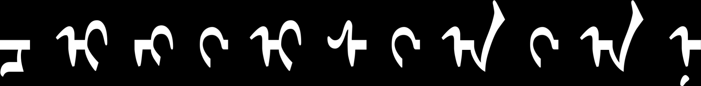

# Five different Mongolian fonts

Mongolian Baiti

Noto Sans Mongolian

Mongolian Title

Mongolian White

Mongolian Writing

(all the images on this page generated with this [script](mongolian-variants.sh)

# Free Variation Selectors

## Mongolian Baiti:

Mongolian Baiti FVS1:

## Noto Sans Mongolian:

Noto Sans Mongolian FVS1:

Noto Sans Mongolian FVS2:

## Mongolian Title:

Mongolian Title FVS1:

## Mongolian White:

Mongolian White FVS1:

Mongolian White FVS2:

Mongolian White FVS3:

## Mongolian Writing:

Mongolian Writing FVS1:

Mongolian Writing FVS2:

Mongolian Writing FVS3:

